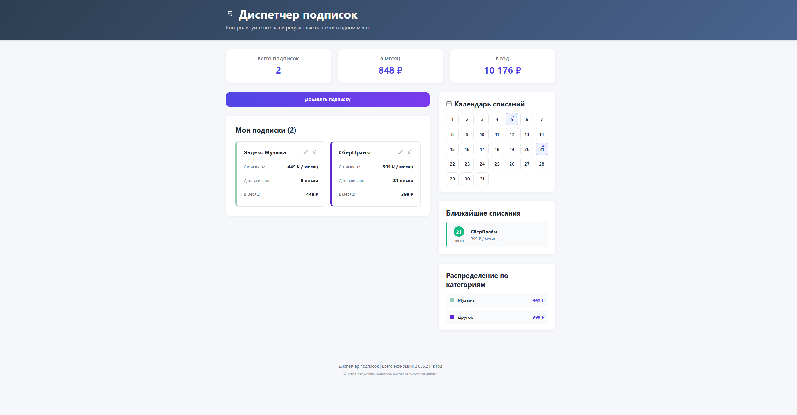
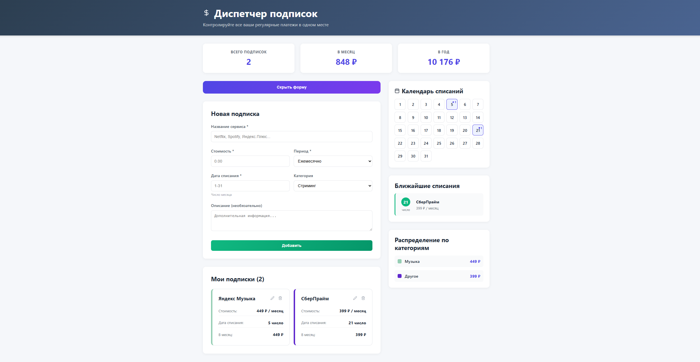

# Subscription Manager — Диспетчер подписок

**Subscription Manager** — это веб-приложение на React, позволяющее управлять регулярными подписками: добавлять, редактировать, удалять подписки, отслеживать ежемесячные и годовые расходы, видеть календарь списаний и распределение по категориям. Данные сохраняются в localStorage браузера, поэтому приложение работает без бэкенда.

### Главная страница


### Форма добавления подписки



---
## Структура проекта
```
subscription-manager/
├── public/ # Статические файлы
├── src/
│ ├── components/ # React-компоненты
│ │ ├── Header.jsx
│ │ ├── Footer.jsx
│ │ ├── StatsCards.jsx
│ │ ├── SubscriptionForm.jsx
│ │ ├── SubscriptionList.jsx
│ │ ├── SubscriptionCard.jsx
│ │ ├── CalendarSection.jsx
│ │ ├── UpcomingCharges.jsx
│ │ └── CategoryBreakdown.jsx
│ ├── utils/ # Вспомогательные функции
│ │ └── helpers.js
│ ├── App.jsx # Корневой компонент
│ ├── App.css # Глобальные стили
│ └── index.js # Точка входа
├── .gitignore
├── package.json
└── README.md
```

## Функции

- 📋 **Управление подписками**
  - Добавление новой подписки с названием, стоимостью, периодом (ежемесячно, ежегодно, еженедельно, ежедневно), датой списания (число месяца), категорией и описанием
  - Редактирование существующей подписки
  - Удаление подписки

- 📊 **Статистика**
  - Количество активных подписок
  - Суммарные расходы в месяц и в год

- 📅 **Календарь списаний**
  - Визуальное отображение дней месяца с указанием количества списаний
  - При наведении показываются названия и суммы подписок, привязанных к конкретному числу

- ⏰ **Ближайшие списания**
  - Список подписок, списания по которым предстоят в текущем месяце (отсортированы по дате)

- 🏷️ **Категории**
  - Распределение расходов по категориям (стриминг, софт, обучение, музыка, облако, другое)

- 💾 **Локальное хранение**
  - Все данные автоматически сохраняются в localStorage браузера и восстанавливаются при перезагрузке страницы

## Используемые технологии

| Технология       | Назначение                          |
|------------------|-------------------------------------|
| React 18+        | Библиотека для построения интерфейса |
| JavaScript (ES6) | Язык разработки                     |
| CSS3             | Стилизация компонентов              |
| Lucide React     | Иконки                              |
| LocalStorage API | Хранение данных на стороне клиента  |
| Create React App | Сборка проекта (или Vite)           |

## Как запустить локально

### Предварительные условия
- Node.js (версия 14 или выше)
- npm (обычно устанавливается вместе с Node.js)
- Git (опционально, для клонирования репозитория)

### Шаги

1. **Клонировать репозиторий** (или скачать исходный код)
   ```bash
   git clone https://github.com/Artemka52/subscription-manager.git
   cd subscription-manager
   ```

2. **Установить зависимости**
   ```bash
   npm install
   ```

3. **Запустить приложение в режиме разработки**
   ```bash
   npm start
   ```
   После этого откроется браузер с адресом [http://localhost:3000](http://localhost:3000). Если этого не произошло, откройте указанный URL вручную.

4. **Сборка для production** (опционально)
   ```bash
   npm run build
   ```
   Готовые файлы для развёртывания появятся в папке `build`.

## Как использовать

1. **Добавление подписки**
   - Нажмите кнопку «Добавить подписку».
   - Заполните форму: название, стоимость, период, дату списания (число от 1 до 31), категорию, при необходимости описание.
   - Нажмите «Добавить» (или «Обновить» при редактировании).

2. **Просмотр списка подписок**
   - Все добавленные подписки отображаются в левой колонке в виде карточек.
   
3. **Статистика**
   - Вверху страницы показаны общее количество подписок, суммарные расходы в месяц и в год.

4. **Календарь списаний**
   - В правой колонке представлен календарь на текущий месяц. Дни, в которые есть списания, выделены точкой и количеством подписок. При наведении отображаются названия и суммы.

5. **Ближайшие списания**
   - Ниже календаря показаны подписки, списания по которым предстоят в текущем месяце (от сегодняшнего числа и далее).

6. **Распределение по категориям**
   - В правой колонке отображается список категорий с итоговыми суммами расходов по каждой.

7. **Редактирование и удаление**
   - Для редактирования нажмите иконку карандаша на карточке подписки, внесите изменения и сохраните.
   - Для удаления нажмите иконку корзины и подтвердите действие.


